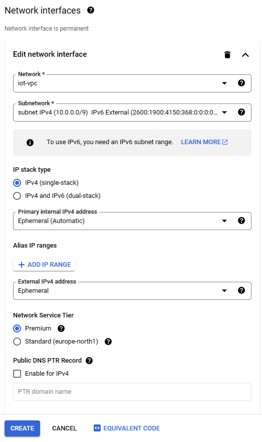

# IoT-miniproject-1

## Overview

### Introduction

**IoT-miniproject-1** is the project work assigned at the Internet of Things (521043S-3004) course at University of Oulu in 2023. Goal of the project is to create a firmware for a spesific microcontroller, enabling a secure and energy-efficent transmission of sensor data from microcontroller to a cloud-backend using IPv6 protocol. 

The project uses [Fit IoT-Lab](https://www.iot-lab.info/) remote testbed to book IoT-devices, to program them, interact with them and control them.

Simple python CoAp server is used to receive temperature data from iot-lab node. The server writes the temperature data to a file, where it could be shown.

### Table of Contents

- [Video tutorial](#video-tutorial)
- [Create linux virtual machine](#create-linux-virtual-machine)
    - [Set up Google cloud VM](#set-up-google-cloud-vm)
    - [Create Virtual private cloud](#create-virtual-private-cloud)
    - [Firewall rules](#firewall-rules)
    - [Create VM instance](#create-vm-instance)
- [Set up CoAP server](#set-up-coap-server)
    - [Install all the dependencies and set up the python3 virtual environment.](#install-all-the-dependencies-and-set-up-the-python3-virtual-environment)
    - [Start CoAp server](#start-coap-server)
    - [LOGS](#logs)
    - [DATA](#data)
- [Set up the iot-lab-nodes](#set-up-the-iot-lab-nodes)
    - [IoT-lab account](#iot-lab-account)
    - [SSH connection to iot-lab](#ssh-connection-to-iot-lab)
    - [Build the project](#build-the-project)
    - [Set up Fit IoT-Lab experiment](#set-up-fit-iot-lab-experiment)
    - [Set up border router](#set-up-border-router)
    - [Flash iot-lab node](#flash-iot-lab-node)
    - [Free up iot-lab resources](#free-up-iot-lab-resources)
- [Code Structure](#code-structure)
- [Authors](#authors)

## Video tutorial
[Link to tutorial](youtube.com)

## Create linux virtual machine

For CoAp server a linux virtual machine is needed. Any linux virtual machine should work, but we walk through how to set up Google Cloud virtual machine. Google cloud has a free trial with 300$ credits to use. The virtual machine needs a external IPV6 ip address for connection with the iot-lab node. 

Requirements for the virtual machine:
- runs linux, preferably Ubuntu 20.04
- has external IPV6 address for connecting with iot-lab nodes, as RIOT supports only ipv6
- CoAp port 8683 open
- ICMPv6 traffic allowed
- SSH connection to the VM

### Set up Google cloud VM

Google Cloud account is needed for using google Cloud services. At the time being, 300 credits can be obtained for use in 3 months time period for free. Below are a link to where a google cloud account can be created.

https://console.cloud.google.com/?hl=en&_ga=2.87814171.-2055644655.1699615458&_gac=1.116033140.1702051941.CjwKCAiAmsurBhBvEiwA6e-WPIQOg4lsX1QJevny4vxo9FBotFtCxOCFgTHR5MXrhSOSkf66HEamdRoCthsQAvD_BwE

### Create Virtual private cloud

Next step is to create vpc (virtual private cloud) for the VM. This is necessary to get the external ipv6 address for the VM. The VPC:s can be managed at following google cloud console site.

https://console.cloud.google.com/networking/networks?hl=en&_ga=2.16771894.-1464318792.1699625730&_gac=1.195093086.1701470264.CjwKCAiApaarBhB7EiwAYiMwqnFJQWu6iGIMccKLYWIfXNoxHQGC0UXqAEzLXMDN3NWpUHO9M_Fa9RoC834QAvD_BwE

VPC can be created by pressing the `CREATE VPC NETWORK` button on the top bar.


Below are all the setting I used to create the VPC.

<details><summary>VPC settings</summary>


Select all these firewall rules for both ipv4 and ipv6!


</details>

### Firewall rules

Firewall rules are a set of instructions that control how a firewall device handles incoming and outgoing traffic. They are access control mechanisms that enforce security in networks by blocking or allowing communication based on predetermined criteria. 

Firewall rules can be managed at Google Cloud firewall rules website: 

https://console.cloud.google.com/net-security/firewall-manager/firewall-policies

For the coap server, a firewall rule that allows udp traffic on CoAp port 8683 must be created.
This rule can be created by clicking the `CREATE FIREWALL RULE` button and using the following settings: 


<details><summary>Firewall rule: allow udp 8683</summary>


</details>

If you have followd according to this tutorial, you should have these firewall rules for the newly created VPC. Notice, that there are also some firewall rules for default VPC.


If the firewall rules of your VPC are similar, you can continue.

### Create VM instance

The Virtual machine is used to deploy the Coap server. Google cloud VM:s can be managed from the Google Cloud console instances website.

https://console.cloud.google.com/compute/instances

Click the `CREATE INSTANCE` button. And change the settings mentioned on the dropdown below.


<details><summary>VM instance settings</summary>

Notice! It is important that the VM region is the same as the VPC subnet region.
For the machine type I have chosen the e2-small. This have been enough for the CoAp server.


The linux image should be changed to Ubuntu 20.04 under `Boot Disk`


Under Advanced options the Networking settings must be changed. 

1. Change the Network interface from default to the newly created VPC. 
2. The subnetwork should be automatically selected to the one that you created.
3. Select the `IP stack type` to be IPv4 and IPv6 (dual-stack)


</details>

Now everything should be properly set up and the VM instance can be created. The instance should dispaly the external ipv6 address.


The SSH connection to the VM instance can be made by clicking the SSH button under Connect. This creates new window with the ssh connection.

## Set up CoAP server

Connect to the linux VM, where you want the the CoAp server to be deployed.

### Install all the dependencies and set up the python3 virtual environment.

1. Clone the repository to your folder of choise:

    ```bash
    git clone https://github.com/matluuk/IoT-miniproject-1.git
    ```

2. move to the Coap server directory
    ```bash
    cd IoT-miniproject-1/Coap-Server/
    ```

3. update apt-get
    ```bash
    sudo apt-get update
    ```

4. Create python venv

    * install python3.8-venv
        ```bash
        sudo apt install python3.8-venv -y
        ```

    * Create the python venv 
    
        Notice - Use the start_server.sh script activates the venv automatically, so use exactly the same venv location and name

        ```bash
        python3 -m venv ./venv
        ```

5. install aiocoap

    First all dependencies have to be installed:

    * install autoconf on linux 

        ```bash
        sudo apt-get install autoconf -y
        ```

    * install python-dev for 

        ```bash
        sudo apt-get install python-dev-is-python3 -y
        ```

    * install build-essential

        ```bash
        sudo apt-get install build-essential -y
        ```

    * Finally install aiocoap to the activated python venv

        ```bash
        pip3 install --upgrade "aiocoap[all]"
        ```
### Start CoAp server

1. Check the external ipv6 address for your VM.

    * Install net-tools
        ```bash
        sudo apt-get install net-tools -y
        ```
    * Check the external ipv6 address
        ```bash
        ifconfig
        # output:
        ens4: flags=4163<UP,BROADCAST,RUNNING,MULTICAST>  mtu 1460
                inet 10.0.0.5  netmask 255.255.255.255  broadcast 0.0.0.0
                inet6 fe80::4001:aff:fe00:5  prefixlen 64  scopeid 0x20<link>
                inet6 2600:1900:4150:368:0:3::  prefixlen 128  scopeid 0x0<global> # Take the ipv6 address from this line
                ether 42:01:0a:00:00:05  txqueuelen 1000  (Ethernet)
                RX packets 10765  bytes 114444072 (114.4 MB)
                RX errors 0  dropped 0  overruns 0  frame 0
                TX packets 7960  bytes 938787 (938.7 KB)
                TX errors 0  dropped 0 overruns 0  carrier 0  collisions 0

        lo: flags=73<UP,LOOPBACK,RUNNING>  mtu 65536
                inet 127.0.0.1  netmask 255.0.0.0
                inet6 ::1  prefixlen 128  scopeid 0x10<host>
                loop  txqueuelen 1000  (Local Loopback)
                RX packets 216  bytes 22910 (22.9 KB)
                RX errors 0  dropped 0  overruns 0  frame 0
                TX packets 216  bytes 22910 (22.9 KB)
                TX errors 0  dropped 0 overruns 0  carrier 0  collisions 0
        ```

2. Start the CoAp server using your external ipv6 address and port 8683
    ```bash
    sh start_server.sh ip=<external-ipv6-address-of-the-VM> port=8683
    ```

The `start_server.sh` uses nohup to start the server. Press `enter` to go back to console. 

Server are now running on the background and can be stopped using the `stop_server.sh` script.
```bash
sh stop_server.sh
```
### LOGS

The CoAp server saves logs of every session to `logs` folder. To take a look on the log created. 
1. Go to the `logs` folder:
    ```bash
    cd logs
    ```

2. The `tail` command can be used to show the logs in real time.
    ```bash
    tail -f ./<name-of-the-lates-log-file>.log
    ```
### DATA

The temperature data is stored in files under data folder. One file is made for each day, when temperature datais received. Notice that the data folder is created, when the first temperature vaule is received.

1. Go to the `data` folder:
    ```bash
    cd data
    ```
2. The temperature data can be shown using the `tail` command.
    ```bash
    tail -f ./<name-of-the-lates-data-file>.txt
    ```

## Set up the iot-lab-nodes

### IoT-lab account

IoT-lab account is requiret to work with iot-lab. It can be requested by filling a sign up form. More information about iot-lab account can be found from iot-lab documentation.

* [sign-up form](https://www.iot-lab.info/testbed/signup)
* [more information about iot-lab accounts](https://iot-lab.github.io/docs/getting-started/user-account/)

### SSH connection to iot-lab

SSH connection to the iot-lab sites can be created by following iot-lab documentation about it:

* [IoT-lab SSH documentation](https://iot-lab.github.io/docs/getting-started/ssh-access/)

### Build the project

In this tutorial we use grenoble iot-lab site. Other sites with IoT-LAB M3 board could be also used. More information about iot-lab sites can be cound from iot-lab documentation.

* [iot-lab sites](https://iot-lab.github.io/docs/deployment/grenoble/)

1. Connect to grenoble.iot-lab.info:

    ```batch
    ssh <username>@grenoble.iot-lab.info
    ```

2. Clone the repository to your folder of choise at grenoble.iot-lab.info:

    ```bash
    git clone https://github.com/matluuk/IoT-miniproject-1.git
    ```

3. Init the RIOT-submodule:

    ```bash
    git submodule init
    ```

4. Update the RIOT-submodule:

    ```bash
    git submodule update
    ```

5. Change into the miniproject-1 repository working directory:

    ```bash
    cd IoT-miniproject-1/app
    ```

6. Set source:

    ```bash
    source /opt/riot.source
    ```

7. Build the project:

    ```bash
    make
    ```


### Set up Fit IoT-Lab experiment

Set up Fit IoT-Lab experiment with two nodes for device firmware and border router:

1. Connect to grenoble.iot-lab.info IF not already:

    ```batch
    ssh <username>@grenoble.iot-lab.info
    ```

2. Submit an experiment for two nodes at grenoble for 60 minutes:

    ```bash
    iotlab-experiment submit -n "IoT-miniproject-1" -d 60 -l 2,archi=m3:at86rf231+site=grenoble
    ```

3. Wait for the experiment to be in the Running state:

    ```bash
    iotlab-experiment wait --timeout 30 --cancel-on-timeout
    ```

4. Get the experiment nodes list:

    ```bash
    # Command returns the ID of both nodes, they are needed later!
    iotlab-experiment --jmespath="items[*].network_address | sort(@)" get --nodes
    ```

### Set up border router

One iot-lab node is used as a border router. The connection to the internet is made through the border router.

More information about iot-lab ipv6 connections and the border router can be found [from iot-lab documentation.](https://iot-lab.github.io/docs/getting-started/ipv6/)

1. Connect to grenoble.iot-lab.info IF not already:

    ```batch
    ssh <username>@grenoble.iot-lab.info
    ```

2. Change into the miniproject-1 repository directory:

    ```bash
    cd IoT-miniproject-1
    ```

3. Run flash_border_router.sh after booking the experiment:

    ```bash
    sh flash_border_router.sh <board-id>
    ```

    ```bash
    # Example to get correct <board.id>

    user@grenoble.iot-lab.info:~$ iotlab-experiment --jmespath="items[*].network_address | sort(@)" get --nodes
    [
    "m3-6.grenoble.iot-lab.info",
    "m3-7.grenoble.iot-lab.info"
    ]
    # In this example <board-id> = 6 or 7
    # Only need to pick one ID!
    ```

4. Check which tap interfaces are open:

    ```bash
    ip addr show | grep tap
    ```

5. Check which ipv6 prefixes are already used:

    ```bash
    ip -6 route
    ```

6. Launch the ethos_uhcpd command with:

    ```bash
    sudo ethos_uhcpd.py m3-<id> tap<num> <ipv6_prefix>::/64
    ```

    ```bash
    # Example to get correct <id>, <num> and <ipv6_prefix>
    
    # For <id>:
    # Use the same ID as you chose earlier with command: sh flash_border_router.sh <board-id>

    #For <num>:
    user@grenoble.iot-lab.info:~$ ip addr show | grep tap
    313: tap0: <NO-CARRIER,BROADCAST,MULTICAST,UP> mtu 1500 qdisc pfifo_fast state DOWN group default qlen 1000
    ...
    316: tap1: <NO-CARRIER,BROADCAST,MULTICAST,UP> mtu 1500 qdisc pfifo_fast state DOWN group default qlen 1000
    ...
    582: tap8: <NO-CARRIER,BROADCAST,MULTICAST,UP> mtu 1500 qdisc pfifo_fast state DOWN group default qlen 1000
    ...
    # Example list of network interfaces already in use. This example has 3 network interfaces (eg. tap0, tap1 and tap8). 
    # Choose a free interface, for example <id> = tap8 + 1 = 9

    #For <ipv6_prefix>
    user@grenoble.iot-lab.info:~$ ip -6 route
    2001:660:5307:3100::/64 via fe80::2 dev tap0 metric 1024 linkdown  pref medium
    2001:660:5307:3102::/64 via fe80::2 dev tap2 metric 1024 linkdown  pref medium
    2001:660:5307:3103::/64 via fe80::2 dev tap3 metric 1024 linkdown  pref medium
    2001:660:5307:3104::/64 via fe80::2 dev tap4 metric 1024 linkdown  pref medium
    2001:660:5307:3107::/64 via fe80::2 dev tap100 metric 1024 linkdown  pref medium
    ...
    # Example list of ipv6 prefixes in use. 
    # Choose a free prefix, for example <ipv6_prefix> = 2001:660:5307:3108
    ```

7. After launching ethos_uhcpd, leave the script running!

### Flash iot-lab node

To flash the application to iot-lab node, follow these guidelines:

1. Open new ssh connection to grenoble.iot-lab.info:

    ```batch
    ssh <username>@grenoble.iot-lab.info
    ```

2. Change into the miniproject-1 repository working directory:

    ```bash
    cd IoT-miniproject-1/app
    ```

3. Set source:

    ```bash
    source /opt/riot.source
    ```

4. Flash the firmware into the experiment node. Use different `<board-id>` than for border router.

    ```bash
    make IOTLAB_NODE=m3-<board-id> DEFAULT_CHANNEL=18 DEFAULT_PAN_ID=0xbcb4 flash 
    ```

### Terminal connection to iot-lab node

Terminal connection can be used to see what is happening on iot-lab node. Terminal connection can be made with `nc` command. Notice that the terminal connection is made automatically for the border router, when using the ethos_uhcpd command.

* Command:
    ```bash
    nc m3-<board-id> 20000
    ```

The application prints some information about what is happening in the program. `help` command can be used to list all available commands. The `ping` command is especially useful to see if internet connection is working.

### Free up iot-lab resources

After finished with the iot-lab experiment, stop your experiment to free up the nodes used at Fit IoT-Lab:

```bash
iotlab-experiment stop
```


## Code Structure

The project has the following code structure:

```plaintext
.
├── app
│   ├── main.c
│   └── Makefile
├── Coap-Server
│   ├── server.py
│   └── start_server.sh
│   └── stop_server.sh
├── RIOT
│   └── ...
├── images
│   └── ...
├── flash_border_router.sh
└── README.md
```

## Authors

- **Hermanni Hanhela** - [GitHub Profile](https://github.com/HHanhela)
- **Matti Luukkonen** - [GitHub Profile](https://github.com/matluuk)
- **Touko Kinnunen** - [GitHub Profile](https://github.com/toukokinnunen)
